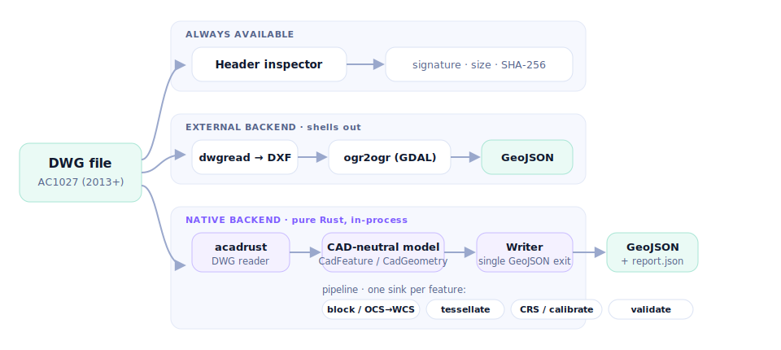
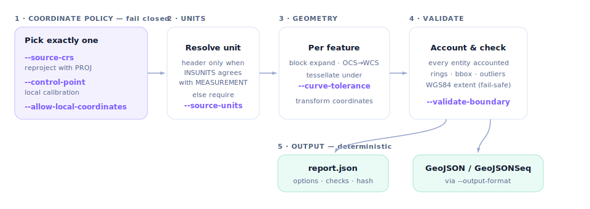

# dwg2geo

[](https://github.com/milkway/dwg2geo/actions/workflows/ci.yml)
[](https://github.com/milkway/dwg2geo/releases)
[](LICENSE-MIT)
[](https://www.rust-lang.org)
[](https://github.com/milkway/dwg2geo/releases)
[](https://milkway.github.io/dwg2geo/)
[](https://crates.io/crates/dwg2geo)
[](https://www.npmjs.com/package/dwg2geo)
[](https://pypi.org/project/dwg2geo/)

An open-source CLI that converts engineering DWG drawings to GeoJSON with explicit coordinate-reference handling, diagnostics, and traceable conversion reports.

**Website & docs:** <https://milkway.github.io/dwg2geo/>

## Download

**Latest release: [v0.2.1](https://github.com/milkway/dwg2geo/releases/latest)** — self-contained `native-backend` binaries, no LibreDWG/GDAL/PROJ required. Each archive bundles the binary plus shell completions and man pages; verify it against its `.sha256` (or the aggregated [`SHA256SUMS`](https://github.com/milkway/dwg2geo/releases/download/v0.2.1/SHA256SUMS)).

| Platform | Download |
|---|---|
| Linux (x86_64) | [`dwg2geo-v0.2.1-x86_64-unknown-linux-gnu.tar.gz`](https://github.com/milkway/dwg2geo/releases/download/v0.2.1/dwg2geo-v0.2.1-x86_64-unknown-linux-gnu.tar.gz) |
| macOS (Apple Silicon) | [`dwg2geo-v0.2.1-aarch64-apple-darwin.tar.gz`](https://github.com/milkway/dwg2geo/releases/download/v0.2.1/dwg2geo-v0.2.1-aarch64-apple-darwin.tar.gz) |
| macOS (Intel) | [`dwg2geo-v0.2.1-x86_64-apple-darwin.tar.gz`](https://github.com/milkway/dwg2geo/releases/download/v0.2.1/dwg2geo-v0.2.1-x86_64-apple-darwin.tar.gz) |
| Windows (x86_64) | [`dwg2geo-v0.2.1-x86_64-pc-windows-msvc.zip`](https://github.com/milkway/dwg2geo/releases/download/v0.2.1/dwg2geo-v0.2.1-x86_64-pc-windows-msvc.zip) |

Prefer to build it yourself? See [Start](#start). Reprojection with `--source-crs` needs the `native-reproject` feature and system PROJ ≥ 9.6, so it is not shipped in the prebuilt binaries.

## Install from a package registry

The converter is also published as a library for three ecosystems:

| Ecosystem | Package | Install | Use |
|---|---|---|---|
| Rust | [crates.io/crates/dwg2geo](https://crates.io/crates/dwg2geo) | `cargo add dwg2geo --features native-backend` (or `cargo install dwg2geo` for the CLI) | `dwg2geo::backend::native::convert_bytes(...)` |
| JavaScript / WASM | [npmjs.com/package/dwg2geo](https://www.npmjs.com/package/dwg2geo) | `npm install dwg2geo` | `import init, { convert } from 'dwg2geo'` — runs in the browser, no native deps ([source](bindings/js/)) |
| Python | [pypi.org/project/dwg2geo](https://pypi.org/project/dwg2geo/) | `pip install dwg2geo` | `dwg2geo.convert_file("drawing.dwg")` → result dict ([source](bindings/python/)) |
| R | [github.com/milkway/dwg2geo-r](https://github.com/milkway/dwg2geo-r) | `pak::pak("milkway/dwg2geo-r")` (CRAN submission in progress) | `dwg_convert("drawing.dwg")` → result + tibbles ([docs](https://milkway.github.io/dwg2geo-r/)) |

All three wrap the same native conversion core, are deterministic (the same bytes always produce byte-identical GeoJSON on a given platform), and never guess a CRS — reprojection stays explicit and in your hands. Across platforms (e.g. native vs WebAssembly) a handful of floating-point values may differ in the last digit (observed max 1e-9, from libm rounding); feature sets and geometry are otherwise identical.

## Current scope

The CLI ships a conservative external-tool MVP in the default build and an in-process native backend behind optional Cargo features:

- `dwg2geo inspect`: reads the six-byte DWG signature, reports the AutoCAD generation, size, and SHA-256 without requiring LibreDWG or GDAL.
- `dwg2geo doctor`: checks whether `dwgread` and `ogr2ogr` are available, including versions; `--json` emits a machine-readable report and the exit code reflects tool health.
- `dwg2geo convert`: either:
  - converts DWG -> DXF with LibreDWG and reprojects DXF -> GeoJSON with GDAL, when `--source-crs` is provided; or
  - exports raw/local coordinates directly through LibreDWG only when `--allow-local-coordinates` is explicit.
- `native-backend` adds full native inspection, `layers`, native conversion for the supported entity set, block expansion, local-coordinate output, and control-point calibration without requiring LibreDWG or GDAL.
- `native-reproject` extends that native path with in-process PROJ reprojection, explicit source-unit handling, and geographic sanity checks.

Every successful conversion also writes a sidecar report at `<output>.report.json` recording the CLI options, external tool versions, source signature and SHA-256, executed commands with timings, and warnings. Apart from the duration fields, the report is deterministic for the same input and options.

Convert options for traceability and control:

- `--keep-intermediate` keeps the LibreDWG DXF at `<output>.intermediate.dxf` for diagnostics (GDAL route).
- `--include-layers` / `--exclude-layers` restrict the GDAL route to a comma-separated layer subset via an attribute filter; they require `--source-crs`.
- Overwrites are explicit: an existing output fails without `--force`, and even with `--force` the previous file is replaced only after the new output is complete. Failed runs remove their partial output; nothing is silently truncated.

The uploaded reference drawing and all data derived from it (metadata, entity histogram, validation notes) are **kept out of this repository** — the entire `samples/` directory is git-ignored. Regenerate the metadata and histogram locally with `dwg2geo inspect <file> --json`.

## Why fail closed on CRS?

A DWG can use SIRGAS 2000 / UTM, SAD69, a local engineering grid, millimetres, or arbitrary coordinates. GeoJSON output that merely copies CAD coordinates can be syntactically valid while geographically wrong. Therefore, conversion requires `--source-crs` unless the caller explicitly accepts local coordinates.

## Requirements

For repository development:

- Rust stable, edition 2024, Rust 1.85 or newer.

For the external conversion backend:

- GNU LibreDWG command `dwgread`.
- GDAL command `ogr2ogr` when reprojection is requested.

Package names vary by operating system. Confirm that these commands work:

```bash

dwgread --version
ogr2ogr --version
```

## Start

```bash
cargo check
cargo test
cargo run -- doctor
```

Copy the engineering file locally, without committing it:

```bash
mkdir -p samples
cp "/path/to/_Corredor Sul.dwg" samples/
```

Inspect it:

```bash
cargo run -- inspect "samples/_Corredor Sul.dwg" --json
```

Convert with a known source CRS:

```bash
cargo run -- convert \
  "samples/_Corredor Sul.dwg" \
  --output output/corredor-sul.geojson \
  --source-crs EPSG:31985 \
  --target-crs EPSG:4326
```

`EPSG:31985` above is only an example. Do not use it until the project's actual CRS has been confirmed.

Export local drawing coordinates only:

```bash
cargo run -- convert \
  "samples/_Corredor Sul.dwg" \
  --output output/corredor-sul-local.geojson \
  --allow-local-coordinates
```

## Native backend (optional features)

Building with the pure-Rust `acadrust` reader enables entity-level inspection without LibreDWG or GDAL:

```bash
cargo build --features native-backend
```

With the feature enabled:

- `inspect` additionally reports the DWG version, measurement system, insertion units, model extents, layer and block counts, and an entity histogram split by model space, paper space, block definitions, and unowned entities. A parse failure never hides the file-level report; it appears as an explicit `native_error`.
- `dwg2geo layers <FILE> [--json]` lists every layer with its flags and entity counts by type and space, plus any layer names referenced by entities but missing from the layer table.
- Corrupt files are retried in failsafe mode; recovered reports are labeled `failsafe_recovery` and carry the strict-parse error. Unknown entities and unresolved handles are counted, never dropped.
- `convert --backend native --allow-local-coordinates` converts model-space `POINT`, `LINE`, `LWPOLYLINE`, classic `POLYLINE` (2D and 3D), `ARC`, `CIRCLE`, `ELLIPSE`, `SPLINE`, `3DFACE`, `SOLID`, `HATCH` (boundary loops nested into Polygons/MultiPolygons with holes and explicit ring-repair warnings), and `TEXT`/`MTEXT` (as point features with text properties) to GeoJSON in raw drawing coordinates, entirely in-process. Bulge arc segments are tessellated deterministically under `--curve-tolerance` (max chord error in drawing units, default 0.05, with a 15° angular cap per segment); approximated features are flagged and counted. Closed polylines become closed LineStrings, or Polygons with CCW rings when `--polygonize-closed` is passed. Every skipped or failed entity appears in the report's `native` section with a reason and sample handles; the output carries a `dwg2geo` foreign member marking it as non-geographic. Native reprojection with `--source-crs` is available when the `native-reproject` feature is enabled.
- `convert --backend native --output-format geojson-seq` writes one GeoJSON Feature per line with no FeatureCollection wrapper. Because the wrapper-level non-geographic marker cannot be emitted in this format, it remains recorded with the chosen format in the sidecar report.
- With the `native-reproject` feature, `convert --backend native --source-crs EPSG:xxxxx` reprojects in-process with PROJ. Drawing units come from the DWG header only when `$INSUNITS` and `$MEASUREMENT` agree unambiguously; otherwise the conversion demands `--source-units` (m, mm, cm, dm, km, in, ft, usft). Output targeting EPSG:4326 fails closed when coordinates leave the plausible longitude/latitude range unless `--allow-suspect-extents` is passed, and the report records the resolved unit and provenance, axis order, PROJ pipeline, and PROJ version.
- Every native conversion self-audits in the report: `native.accounting` proves each model-space entity reached exactly one outcome, `native.bbox_drawing`/`bbox_output` record extents before and after any transform, and `native.geometry_checks` validates the final output (non-finite coordinates, empty or degenerate geometry, ring closure and orientation, duplicate vertices) — violations surface as explicit converter-bug warnings. `native.spatial_outliers` additionally flags features far from the main coordinate cluster (title blocks and legends drawn in model space are the typical hit), and `--validate-boundary <GEOJSON>` checks every feature against a reference polygon in the output CRS (e.g. an IBGE municipal boundary) and reports inside/partial/outside counts.
- Without a known CRS, `--control-point "DX,DY=X,Y"` (two or more, native backend) georeferences by a local similarity calibration — rotation, uniform scale, and translation only, so geometry is never sheared. Three or more points report per-point residuals, RMS, and max error in the sidecar report; the output's `dwg2geo` member is marked `calibrated`.
- `INSERT` block references are expanded into their block geometry by default (`--explode-blocks` documents the choice): translation, insert-normal orientation, rotation, non-uniform scale, MINSERT row/column grids, and nesting up to 16 levels are composed per instance, with recursive or missing block definitions reported as failed INSERTs. Expanded features carry a `block_path` property and instance-unique ids; block content on layer `0` inherits the insert's layer (the original is kept in `source_layer`). `--preserve-inserts` instead emits each INSERT as a point feature with `block_name`, rotation, and attribute values; inserts with attributes also emit that anchor point when exploding. Every feature carries resolved style metadata: ByLayer/ByBlock colors, linetypes, and line weights are resolved through the layer table and the insert chain into `color_index`/`color_rgb`/`linetype`/`lineweight_mm` (unresolvable color/linetype policies are emitted verbatim; `lineweight_mm` is optional and omitted for the AutoCAD *Default* weight, which is plot-configuration dependent), and text rotation inside blocks follows the insert's rotation.

The separate `native-reproject` feature adds the `proj` crate for native reprojection; it needs system PROJ >= 9.6 or a build toolchain with cmake and sqlite3.

## Repository map

```text
src/                     Rust CLI source
tests/                   integration, golden, differential, and e2e tests
samples/                 local-only drawings and derived data (git-ignored)
THIRD-PARTY-LICENSES.md  full dependency license report
sbom.cdx.json            CycloneDX software bill of materials
Dockerfile               slim, native-only container image
```

## Architecture



- **CLI** parses arguments and rejects ambiguous CRS/unit behavior before any expensive work.
- **Header inspector** reads only stable file-level metadata and works without any CAD library.
- **Backend adapters** — `external` shells out to `dwgread`/`ogr2ogr`; `native` adapts `acadrust`. `acadrust` types never leak past the adapter.
- **CAD-neutral model** (`CadFeature`/`CadGeometry`) is the internal contract every transform, validity check, and statistic operates on; the writer is the single place it becomes GeoJSON (ADR-004).
- **Streaming pipeline** — extraction hands each feature to a sink; the GeoJSONSeq route writes and drops it immediately, so memory is bounded by the parsed document, not the feature count.

### Conversion pipeline & key parameters



## License

`dwg2geo` is released under the **MIT license** (`LICENSE-MIT`). Its own binaries, the prebuilt releases, and the slim container are MIT-clean.

- The native backend's Rust dependencies are permissive (MIT / Apache-2.0 / BSD-3-Clause / Unicode-3.0) plus exactly one weak-copyleft crate, **`acadrust` (MPL-2.0)** — file-level copyleft that places no terms on `dwg2geo`'s source and does not restrict binary distribution. No GPL/LGPL/AGPL dependency is present. See `THIRD-PARTY-LICENSES.md` and `sbom.cdx.json`.
- The **external backend** shells out to **LibreDWG (`dwgread`, GPL-3.0)** and **GDAL (`ogr2ogr`, permissive)** as separate processes. It does not link, embed, or ship them: the copyleft stays with the tools the user installs, so every distributed `dwg2geo` artifact remains MIT. We deliberately do not bundle LibreDWG into any release or image.

## Important constraints

- Never claim geographic correctness unless the source CRS or a control-point transformation is known.
- Never silently discard unsupported entities.
- Preserve CAD provenance in feature properties and in a conversion report.
- Do not commit proprietary or client DWG files.
- Do not implement the DWG binary format from scratch.
